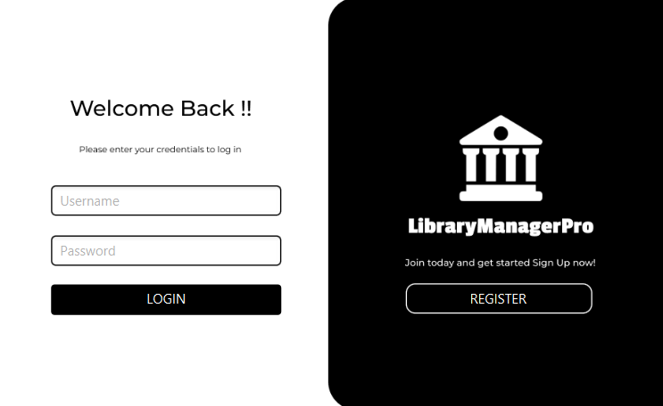

# Library Management System

## Overview

The Library Management System is a desktop application built with JavaFX, Java, and MySQL. It simplifies and automates the management of library resources, providing an intuitive user interface for administrators and users to interact with library functionalities.

## Features

1. **Add Books**: Add new books to the library database.
2. **Member Management**: Manage library members, including adding, updating, or deleting member information.
3. **Staff Management**: Manage library staff accounts and details.
4. **Borrowed Books**: Track the details of borrowed books.
5. **Return Books**: Manage book returns and update the database.
6. **Generate Reports**: Create reports for administrative purposes.
7. **Logout**: Securely log out of the system.
8. **Close**: Exit the application.

## Technology Stack

* **Frontend**: JavaFX
* **Backend**: Java
* **Database**: MySQL

## Prerequisites

1. **Java Development Kit (JDK)**: Version 11 or later.
2. **JavaFX SDK**: Ensure the JavaFX libraries are installed.
3. **MySQL Database**: Installed and running.
4. **IDE**: IntelliJ IDEA, Eclipse, or any IDE of your choice.

## Database Configuration

1. Create a MySQL database for the application.
2. Import the provided `library_management.sql` file to set up the necessary tables.
3. Update the database connection details in the application code:

```java
String url = "jdbc:mysql://localhost:3306/librarydb";
String username = "root";
String password = "1234";
```

## Installation and Setup

1. Clone the repository:

   ```bash
   git clone https://github.com/your-repo/library-management-system.git
   ```
2. Open the project in your IDE.
3. Configure the JavaFX SDK in your IDE settings.
4. Update the database credentials in the configuration file.
5. Build and run the application.

## How to Use

1. Launch the application.
2. Log in using your administrator credentials.
3. Navigate through the dashboard to manage books, members, staff, and more.

## Screenshots




